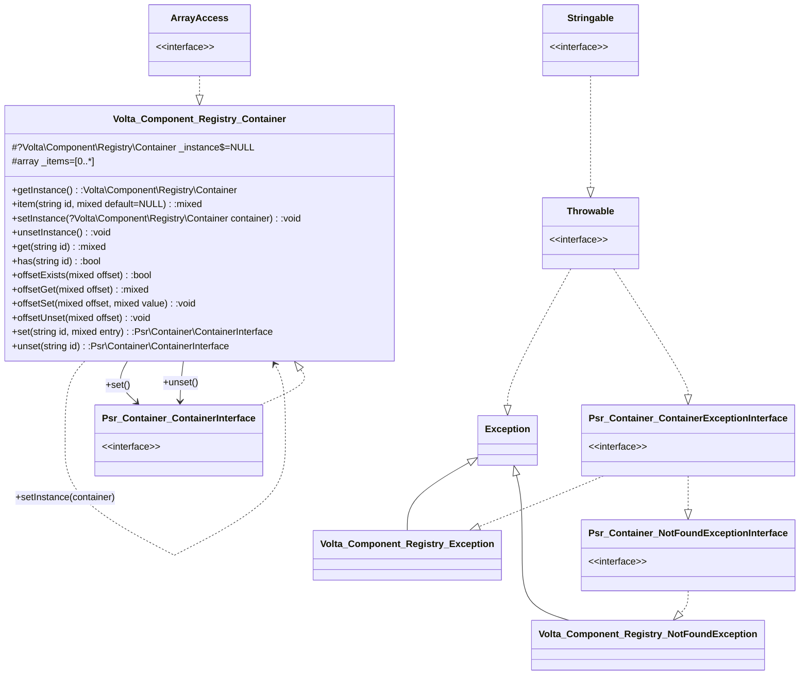

# Volta\Component\Registry\Container

Dependency manager providing *psr/container-implementation 1.0.0.*

See also https://www.php-fig.org/psr/psr-11/

## Classes

* `Volta\Component\Registry\Container` implementing `Psr\Container\ContainerInterface`
* `Volta\Component\Registry\Exception` implementing `Psr\Container\ContainerExceptionInterface`
* `Volta\Component\Registry\NotFoundException` implementing `Psr\Container\NotFoundExceptionInterface`

## Usage

```php
use Volta\Component\Registry\Container;
use Volta\Component\Registry\Exception;
use Volta\Component\Registry\NotFoundException;

$c new Container();
$c->set('name 1', 'value 1');
$c['name 2'] = 'value 2';
echo $c->get('value 2');
echo $c['value 1'];

try {
    $c['name 2'] = 'new value 2';

} catch (Exception $e) {
    // thrown on duplicate entry.
    // To avoid accidentally overwriting an entry an exception is thrown when
    // an entry already exists with the same id. If we need to overwrite an entry
    // we should unset the entry first
    exit($e->getMessage());
}

try{
    echo $c['name 3'];

} catch (NotFoundException as $e) {
    // thrown when entry is not found
    exit($e->getMessage());
}

```
[//]: # (Start Volta\UmlDoc\MermaidDiagram)

[//]: # (End Volta\UmlDoc\MermaidDiagram)
[//]: # (Start Volta\UmlDoc\MdDiagram)

Generated @  20230619 13:50:49

# Volta\Component\Registry\
3 Classes, 0 Interfaces, 0 Traits, 0 Enums,
### [Volta\Component\Registry\Container](#) *implements* Psr\Container\ContainerInterface, ArrayAccess
#### Properties(2)
- protected static ?Volta\Component\Registry\Container **[_instance](#)** = NULL
- protected array **[_items](#)** = [0..*]
#### Methods(12)
- public static function **[getInstance](#)()**: Volta\Component\Registry\Container
- public static function **[item](#)(string id, mixed default=NULL)**: mixed
- public static function **[setInstance](#)(?Volta\Component\Registry\Container container)**: void\
&rdsh; *//public static function setInstance((ContainerInterface&ArrayAccess)|null $container = null): void PHP 8.2*
- public static function **[unsetInstance](#)()**: void
- public function **[get](#)(string id)**: mixed
- public function **[has](#)(string id)**: bool
- public function **[offsetExists](#)(mixed offset)**: bool
- public function **[offsetGet](#)(mixed offset)**: mixed
- public function **[offsetSet](#)(mixed offset, mixed value)**: void
- public function **[offsetUnset](#)(mixed offset)**: void
- public function **[set](#)(string id, mixed entry)**: Psr\Container\ContainerInterface
- public function **[unset](#)(string id)**: Psr\Container\ContainerInterface
### [Volta\Component\Registry\Exception](#) : Exception *implements* Stringable, Throwable, Psr\Container\ContainerExceptionInterface
### [Volta\Component\Registry\NotFoundException](#) : Exception *implements* Stringable, Throwable, Psr\Container\NotFoundExceptionInterface, Psr\Container\ContainerExceptionInterface

[//]: # (End Volta\UmlDoc\MdDiagram)
